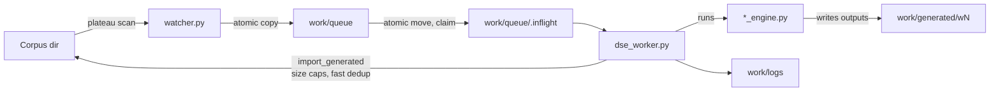

# java-hybrid orchestrator

Minimal orchestrator for running a **hybrid pipeline (coverage fuzzer + DSE)** on Java OSS-Fuzz targets.

Core pipeline:

- `watcher`: detect corpus plateau and enqueue seeds into `work/queue/`
- `dse_worker`: claim seeds, run `engines/*_engine.py`, and import generated inputs back into the corpus

## Quickstart

```bash
python3 -m cli --corpus /path/to/corpus --work-dir work --dse-backend spf --fuzzer-path /path/to/launcher all
```

Help:

```bash
python3 -m cli --help
```

## Architecture



Design points:

- Queue, claim, and import use **atomic rename/copy** so multiple workers can run concurrently.
- Engines are “one seed in, write files to out_tmp” only; timeout/dedup/import policy lives in the worker.

## CLI roles (`cli.py`)

- `watcher`: only plateau detection + enqueue
- `dse`: process seeds (run backend engine + import)
- `all`: spawn 1 watcher + N workers as subprocesses

backend:

- `--dse-backend dummy`: smoke-test engine (`engines/dummy_engine.py`)
- `--dse-backend spf`: SPF/JPF-based DSE (`engines/spf_engine.py`)  
  - requires `--fuzzer-path` (a Jazzer-style OSS-Fuzz launcher script)
- `--dse-backend swat`: placeholder (`engines/swat_engine.py`)

## Work directory (`--work-dir`)

```text
work/
  queue/                # seeds enqueued by watcher
    .inflight/          # claimed seeds (queue -> inflight via atomic move)
  generated/
    w<N>/               # per-worker staging (cleared per seed)
  logs/                 # watcher + worker logs
```

## Queue semantics

- Enqueue name: `"{sha256[:12]}_{original_filename}"`
- Claim name: `"<seed>.w<id>.pid<PID>"`
- Claim order: oldest by mtime first

## Import policy (`util.import_generated`)

Only **top-level files directly under out_tmp** are considered for import (subdirectories are ignored).

- Size bounds: `[Config.min_generated_bytes, Config.max_generated_bytes]`
- Per-seed cap: `Config.max_import_per_seed`
- Fast dedup:
  - within batch: skip duplicates by `fast_fingerprint`
  - against corpus: fingerprint index of up to 20k most-recent files
- Destination naming: `gen_<fingerprint[:16]>_<size>` (atomic copy via temp file + rename)

## Engine contract (`engines/*_engine.py`)

Engines are strictly “one seed per invocation”.

- Input: `<seed_file> <out_dir>`
- Output: write generated inputs as files directly under `out_dir` (import is done by the worker)
- Policy separation: timeout/dedup/import/corpus ownership belongs to `dse_worker.py`

## watcher.py

- Periodically scans the corpus directory and declares a plateau when the **file count stops increasing**.
- On plateau, selects recent-ish candidates (`pick_candidates`) and enqueues up to `Config.seeds_per_plateau`.
- Re-enqueue protection is per-process (`sha256` in-memory); restarting the watcher can re-enqueue the same seed.

## dse_worker.py

- Claim: `util.claim_one_seed` atomically moves `queue/<seed>` → `queue/.inflight/<seed>.w<id>.pid<PID>`
- Stage: clears `work/generated/w<id>` per seed so only this run’s outputs are imported
- Run: executes the engine and writes stdout/stderr to `work/logs/`
- Timeout: after `Config.dse_timeout_sec`, kills the engine process group
- Import: only when `rc == 0`, then deletes the claimed seed file

## SPF backend notes

The SPF engine (`engines/spf_engine.py`) parses the Jazzer launcher to obtain classpath/target class, generates + compiles a harness into a cache directory, then runs JPF.

- Local setup: `scripts/setup_spf.sh` (requires network for git clone)
- Docker workflow: see `docker/README.md`
- Useful env vars:
  - `JPF_HOME`, `JPF_SYMBC`, `SPF_SITE` (defaults under `third_party/spf/`)
  - `SPF_SEED_MAX_BYTES`, `SPF_SYMBOLIC_ARRAYS`, `SPF_USE_SYMBOLIC_LISTENER`
