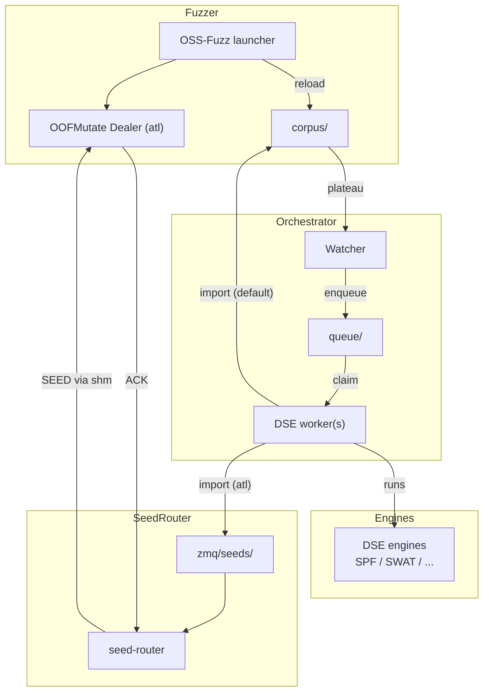

# JFO (Java Fuzz Orchestrator)

JFO runs a **hybrid pipeline (coverage fuzzer + DSE)** for Java OSS-Fuzz targets.

Core pipeline:

- `watcher`: detect corpus plateau and enqueue seeds into `work/queue/`
- `dse_worker`: claim seeds, run `engines/*_engine.py`, and deliver generated inputs based on mode:
  - `default`: to `work/corpus/`
  - `atl`: to `work/zmq/seeds/` (for OOFMutate via ZMQ)

## Quickstart

```bash
# run the full pipeline (seed-router + fuzzer + watcher + DSE workers)
python3 -m jfo --work-dir work --fuzzer-path /path/to/oss-fuzz/build/out/<project>/<FuzzerName>
```

Help:

```bash
python3 -m jfo --help
```

## Architecture



## Code layout

- Entry point: `cli.py` → `jfo/app.py`
- Pipeline orchestration: `jfo/pipeline.py`
- Components:
  - Corpus plateau watcher: `jfo/components/watcher.py`
  - DSE worker: `jfo/components/dse_worker.py`
  - Fuzzer runner: `jfo/components/fuzzer.py`
  - ATL Jazzer launcher generator: `jfo/components/atl_jazzer_launcher.py`
- ZMQ seed-router (process + auto-start helper): `jfo/seed_router.py`
- Utilities: `jfo/util/`

## CLI (`cli.py`)

- Runs the full pipeline (seed-router + fuzzer + watcher + DSE workers).

backend:

- `--dse-backend dummy`: smoke-test engine (`engines/dummy_engine.py`)
- `--dse-backend spf`: SPF/JPF-based DSE (`engines/spf_engine.py`)  
  - requires `--fuzzer-path` (a Jazzer-style OSS-Fuzz launcher script)
- `--dse-backend gdart`: SPouT recording + GDART solving (`engines/gdart_engine.py`)  
  - requires `--fuzzer-path` (a Jazzer-style OSS-Fuzz launcher script)
- `--dse-backend swat`: placeholder (`engines/swat_engine.py`)

Notes:

- Corpus dir is always `<work-dir>/corpus`.
- `--fuzzer-path` is required.

## Work directory (`--work-dir`)

```text
work/
  corpus/               # fuzzer corpus (default)
  queue/                # seeds enqueued by watcher
    .inflight/          # claimed seeds (queue -> inflight via atomic move)
  generated/
    w<N>/               # per-worker staging (cleared per seed)
  logs/                 # watcher + worker logs
  fuzzer/               # generated ATL Jazzer launcher scripts (e.g. atl_<FuzzerName>)
  zmq/
    seeds/              # seed-router watch dir (default)
    router.addr         # chosen ZMQ bind addr for this work-dir
    shm.name            # chosen shared memory name for this work-dir
```

## Queue semantics

- Enqueue name: `"{sha256[:12]}_{original_filename}"`
- Claim name: `"<seed>.w<id>.pid<PID>"`
- Claim order: oldest by mtime first

## Import policy (`jfo/util/fs.py:import_generated`)

Only **top-level files directly under out_tmp** are considered for import (subdirectories are ignored).

- Size bounds:
  - to corpus: `[Config.min_generated_bytes, Config.max_generated_bytes_corpus]`
  - to zmq: `[Config.min_generated_bytes, min(Config.max_generated_bytes_zmq, Config.zmq_max_payload_bytes)]`
- Per-seed cap: `Config.max_import_per_seed`
- Fast dedup:
  - within batch: skip duplicates by `fast_fingerprint`
  - against corpus: fingerprint index of up to 20k most-recent files
- Destination naming: `gen_<fingerprint[:16]>_<size>` (atomic copy via temp file + rename)

## Engine contract (`engines/*_engine.py`)

Engines are strictly “one seed per invocation”.

- Input: `<seed_file> <out_dir>`
- Output: write generated inputs as files directly under `out_dir` (import is done by the worker)
- Policy separation: timeout/dedup/import/corpus ownership belongs to `jfo/components/dse_worker.py`

## `jfo/components/watcher.py`

- Periodically scans the corpus directory and declares a plateau when the **file count stops increasing**.
- On plateau, selects recent-ish candidates (`pick_candidates`) and enqueues up to `Config.seeds_per_plateau`.
- Re-enqueue protection is per-process (`sha256` in-memory); restarting the watcher can re-enqueue the same seed.

## `jfo/components/dse_worker.py`

- Claim: `jfo.util.claim_one_seed` atomically moves `queue/<seed>` → `queue/.inflight/<seed>.w<id>.pid<PID>`
- Stage: clears `work/generated/w<id>` per seed so only this run’s outputs are imported
- Run: executes the engine and writes stdout/stderr to `work/logs/`
- Timeout: after `Config.dse_timeout_sec`, kills the engine process group
- Import: only when `rc == 0`, then deletes the claimed seed file

## SPF backend notes

The SPF engine (`engines/spf_engine.py`) parses the Jazzer launcher to obtain classpath/target class, generates + compiles a harness into a cache directory, then runs JPF.

  - If you want to use Team-Atlanta's `atl-jazzer` fork as the Jazzer binary, you can fetch just that subtree and generate a compatible launcher script (recommended: keep the launcher under this repo so `$this_dir`-relative paths work):
  - Fetch: `scripts/fetch_atl_jazzer.sh --build` (or build manually: `cd third_party/atl-jazzer && bazelisk build //:jazzer`)
  - Generate launcher: `python3 scripts/make_jazzer_launcher.py --out work/FuzzerLauncher --cp '<classpath>' --target-class '<FuzzTargetClass>'`
  - Then run: `python3 -m jfo --work-dir work --mode default --fuzzer-path work/FuzzerLauncher`
  - If you don't want to touch `oss-fuzz/build/out`, generate a separate **ATL Jazzer launcher script** that reuses the OSS-Fuzz target artifacts:
    - `python3 scripts/make_atl_jazzer_wrapper_from_ossfuzz.py --ossfuzz-launcher /path/to/oss-fuzz/build/out/<project>/<FuzzerName> --out /path/to/<atl_FuzzerName>`
    - (optional OOFMutate) add `--zmq-router-addr ... --zmq-harness-id ...` to bake `ATLJAZZER_ZMQ_*` env vars into the launcher

  - If your atl-jazzer build enables **OOFMutate via ZMQ** (Dealer inside libFuzzer), you can deliver SPF-generated inputs to the fuzzer *without copying them into the fuzzer corpus*:
  - Run everything together (router auto-starts and persists its addr under `<work-dir>/zmq/router.addr`):
    - `python3 -m jfo --work-dir work --mode atl --fuzzer-path /path/to/oss-fuzz/build/out/<project>/<FuzzerName> -- -runs=0`
  - Default (corpus-sharing) mode:
    - `python3 -m jfo --work-dir work --mode default --fuzzer-path /path/to/oss-fuzz/build/out/<project>/<FuzzerName>`
  - Notes:
    - `cli` adds `--keep_going=0`, `--reproducer_path=<work-dir>/reproducers`, `-reload=1`, `-artifact_prefix=<work-dir>/artifacts/`, and `-close_fd_mask=3` unless you override them via `--`.
    - `--mode atl` requires a ZMQ Dealer inside the fuzzer (OOFMutate). If no Dealer is detected, the run fails fast (otherwise seeds would just accumulate under `<work-dir>/zmq/seeds` with no ACK).

### ZMQ debugging tips

- Seed-router side:
  - Manual start (normally auto-started by `cli --mode atl`):
    - `python3 -m jfo.seed_router --bind tcp://127.0.0.1:5555 --harness <HARNESS_ID> --work-dir work --log-level DEBUG`
  - Use `--log-level DEBUG` and watch for:
    - `dealer joined` (Dealer heartbeats are arriving)
    - `sent SEED ...` (a seed file was picked and sent)
    - `recv ACK ...` (Dealer acked the seed)
  - Watch the seed directory state transitions:
    - `<name>` -> `<name>.inflight` (sent, waiting for ACK)
    - `<name>.sent` (ACK received; unless `--delete-processed`)

- Dealer/fuzzer side:
  - Set `ATLJAZZER_ZMQ_DEALER_LOG=/tmp/dealer.log` (or rely on `<work-dir>/logs/dealer_<HARNESS_ID>.log`) and check it for:
    - `Connected to router ...`
    - `Received SEED BATCH ...` / `ACK sent ...`

- Local setup: `scripts/setup_spf.sh` (requires network for git clone)
- Docker workflow: see `docker/README.md`
- Useful env vars:
  - `JPF_HOME`, `JPF_SYMBC`, `SPF_SITE` (defaults under `third_party/spf/`)
  - `SPF_SEED_MAX_BYTES`, `SPF_SYMBOLIC_ARRAYS`, `SPF_USE_SYMBOLIC_LISTENER`

## GDART backend notes

The GDART engine (`engines/gdart_engine.py`) uses the DSE framework + SPouT concolic executor.
It runs per seed and produces new inputs by parsing the explored `-Dconcolic.bytes=...` models from GDART output.

Setup:

- Install/build GDART (includes SPouT submodule). Recommended location: `third_party/gdart/`
  - upstream: `https://github.com/tudo-aqua/gdart`
  - build: `cd third_party/gdart && ./build.sh`
- Recommended: `scripts/setup_gdart.sh` (clones into `third_party/gdart/` and builds; then source `scripts/gdart_env.sh`).  
  By default it skips tests; add `--run-tests` if you want upstream tests.
- Or set `GDART_HOME=/path/to/gdart` to point at an existing build.

Tuning (optional):

- `GDART_SEED_MAX_BYTES` (default: 128)
- `GDART_SOLVER` (default: `z3`)
- `GDART_EXPLORE` (default: `dfs`)
- `GDART_TERMINATE_ON` (default: `completion`)
